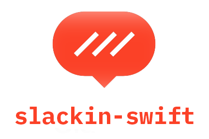

<p align="center">
	
</p>

<p align="center">
    <a href="https://console.bluemix.net">
        
    </a>
    <a href="http://kitura.io">
	
    </a>
    <a href="https://developer.ibm.com/swift/">
	
    </a>
    <a href="https://github.com/RichardLitt/standard-readme">
	
    </a>
</p>

----------------

Create a landing page invited for a Slack instance you want people to join.

Heavily inspired, obviously, by [slackin](https://github.com/rauchg/slackin).

## Requirements

- You must obtain a Slack legacy token. You can do this [here](https://api.slack.com/custom-integrations/legacy-tokens).
- Ability to deploy to Cloud Foundry with at least 128MB of application memory

## Contribute

See [the contribute file](CONTRIBUTING.md)!

PRs accepted.

Small note: If editing the README, please conform to the [standard-readme](https://github.com/RichardLitt/standard-readme) specification.

## Building the Project

1) Clone this repo.   
2) From the root directory, run `swift build`.   
3) From the root directory, run `swift package generate-xcodeproj`.   

## Running in Xcode

1) Create a file in your `~/Documents` directory called `slackkey.txt`.  
2) For the slack you want to run this with, make the only contents of that file the legacy slack token you are working with.  
3) Save the file.

When you run this in Xcode, if you don't provide a token as a command line argument, it will search for this file and read it, and use that. You can debug on `main.swift` to see what it's doing.

If you run this from the command line, you'll want to run:

```bash
.build/debug/slackin-swift **insert token here**
```

## Running in Docker

There is a run script provided with the repository titled `runDocker` that utilizes a local `Dockerfile` for running the app, and `Dockerfile-tools` for building the app. The script takes one parameter, so execute the script like so:

```bash
./runDocker **insert token here**
```

Note that, in the script, the names of the images created can be modified, but everything is consistently named for the sake of simplicity.

## License

[MIT](LICENSE) © 2018 David Okun
